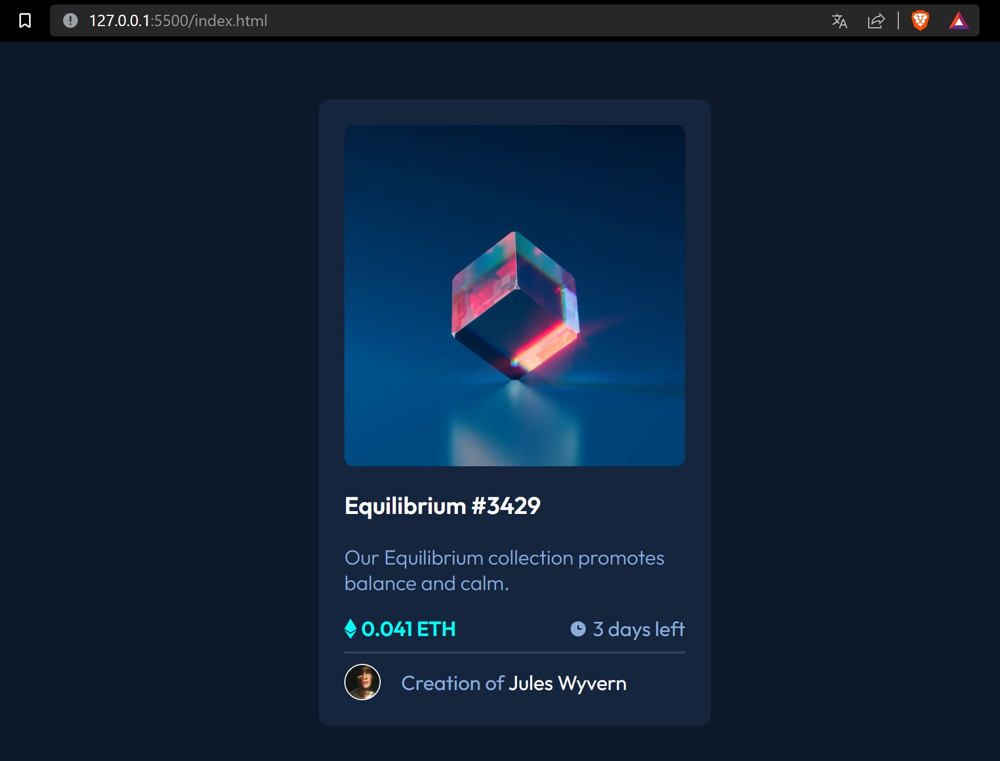
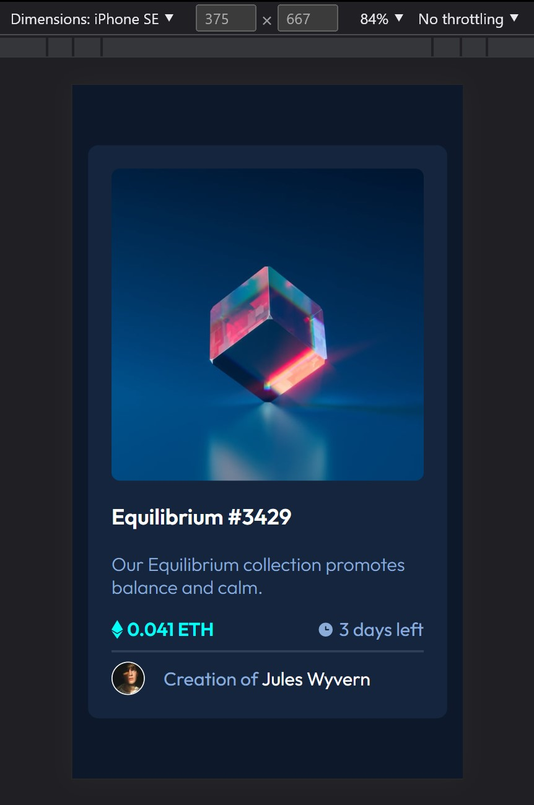

# Frontend Mentor - NFT preview card component solution

This is a solution to the [NFT preview card component challenge on Frontend Mentor](https://www.frontendmentor.io/challenges/nft-preview-card-component-SbdUL_w0U). Frontend Mentor challenges help you improve your coding skills by building realistic projects. 

## Table of contents

- [Frontend Mentor - NFT preview card component solution](#frontend-mentor---nft-preview-card-component-solution)
  - [Table of contents](#table-of-contents)
  - [Overview](#overview)
    - [The challenge](#the-challenge)
    - [📸Screenshot](#screenshot)
    - [🔗Links](#links)
  - [My process](#my-process)
    - [Built with](#built-with)
    - [What I learned](#what-i-learned)
    - [Useful resources](#useful-resources)
  - [Author](#author)
  - [😉 Thanks for your time to read my code](#-thanks-for-your-time-to-read-my-code)

**Note: Delete this note and update the table of contents based on what sections you keep.**

## Overview

### The challenge

Users should be able to:

- View the optimal layout depending on their device's screen size
- See hover states for interactive elements

### 📸Screenshot




### 🔗Links

- 📦 Solution URL: [Github repo](https://github.com/jtlaxcalaDev/Frontend-Mentor-NTF-preview-component)
- 🚀 Live Site URL: [Netlify deploy](https://silly-treacle-a25154.netlify.app)

## My process

### Built with

- ✅ Semantic vanilla HTML5 markup
- ✅ CSS custom properties
- ✅ CSS Flexbox
- ✅ CSS Hover event
- ✅ CSS hsl colors, variables, transform, transition
- ✅ CSS Grid
- ✅ Mobile-first workflow

### What I learned

✨ CSS variables, hover event, transition and transform

```css
.card--avatar:hover {
  transform: scale(1.05);
  transition: ease-in-out .3s;
  border: 1px solid var(--primary-cyan);
}
```
### Useful resources

- 📚 [transform and transition](https://www.w3schools.com/css/css3_transitions.asp) - Use this to see more beauty the hover positions on elements
- 📚 [bg color hsla alpha value](https://css-tricks.com/color-alpha-anywhere/) - Use to effect when positioned into image and put the bg with opacity.

## Author

- 👨‍🚀 Frontend Mentor - [@jtlaxcalaDev](https://www.frontendmentor.io/profile/jtlaxcalaDev)


## 😉 Thanks for your time to read my code
